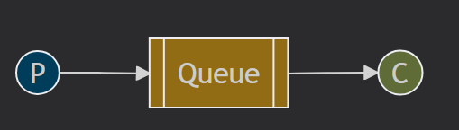

# RabbitMQ

## Running RabbitMQ

Community docker image

```
docker run -d -it --rm --name rabbitmq -p 5672:5672 -p 15672:15672 rabbitmq:4.0-management
```

Python pika

```
pip install pika
```

## Simple queue



### Run example

```
cd simple-queue
```

`send.py` will send a "Hello World!" message to the queue each time it is executed. `receive.py` will get all the messages from the queue as soon as they arrive.

```
python3 receive.py
```

```
python3 send.py
```

Every message that is sent to a queue needs to go through an *exchange*, instead of setting one up explicitly, one can simply use the default exchange ''.

```python
channel.basic_publish(exchange='',
                      routing_key='hello',
                      body='Hello World!')
```

### List active queues

After sending a few messages with `send.py` we can that they show up in the "hello" queue.

```
sudo rabbitmqctl list_queues
```
